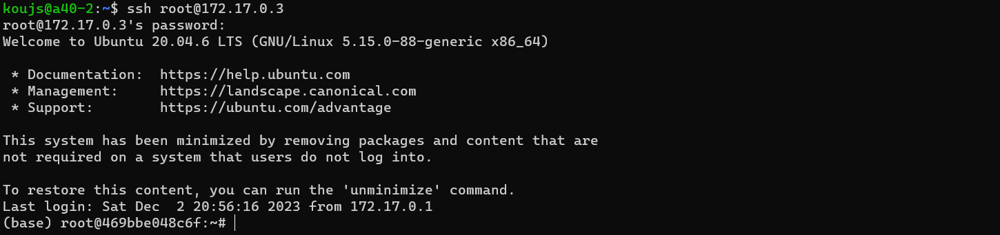
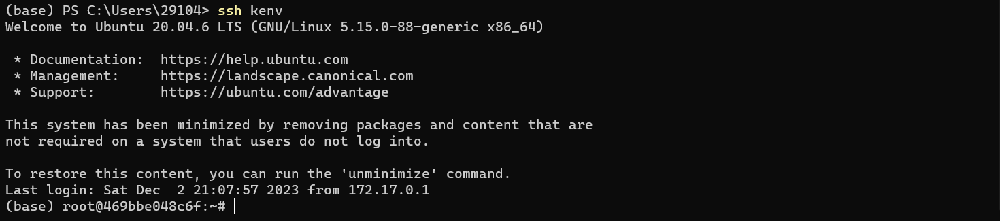
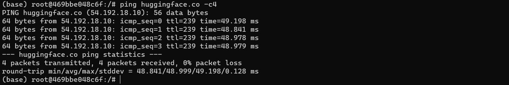

# 配置docker容器走win主机代理

### 1 配置docker容器与win主机的ssh连接

在容器上安装open-ssh并启用ssh服务

```shell
apt update
apt install openssh-server
service ssh start
```

修改`/etc/ssh/sshd_config`，将`#PermitRootLogin without-password`取消注释，改为`PermitRootLogin yes`，再将`#PasswordAuthentication yes`的注释取消，然后`service ssh restart`重启`ssh`服务.

查看docker容器的局域网地址

```shell
docker inspect -f '{{range .NetworkSettings.Networks}}{{.IPAddress}}{{end}}' kenv # kenv替换为你的容器名
```


这时候可以在服务器上用ssh连接docker容器了.



然后再用配置跳板机免密登录的方法，win机器的`C:/Users/username/.ssh/config`添加如下内容

```
Host kenv # 给容器起名字
  HostName 172.17.0.3 # 容器的局域网 IP
  User root
  ProxyJump a40-2 # REMOTE 为远程主机地址：user@ip:port
```

即可在win机器上一键连接docker容器.



### 2 配置docker容器与win主机的ssh端口转发

首先查看你的代理使用什么端口. 以我用的Clash for Windows为例，端口为7890. 用下面的命令配置端口转发并连接容器

```shell
ssh -R 15980:127.0.0.1:7890 kenv #替换为你设置的名字
```

若想在vscode连接时使用端口转发，则在`C:/Users/your_username/.ssh/config`设置

```shell
Host kenv_clash
    HostName 172.17.0.3
    User root
    ProxyJump a40-2 
    RemoteForward 15980 127.0.0.1:7890 # 127.0.0.1不要写成localhost
```

然后在容器内设置代理，就OK了！

```shell
export http_proxy=127.0.0.1:15980
export https_proxy=$http_proxy
# 取消代理用unset http_proxy && unset https_proxy
```



注意以上的操作是一次性的，并非永久，每次登录都要重新设置.