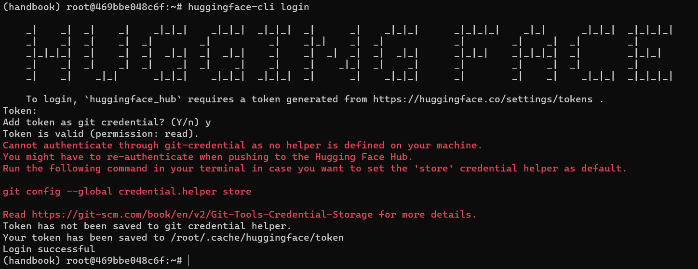

# 在服务器上用docker+miniconda搭建深度学习环境

最近在做毕设，由于实验室的服务器上没有conda，我也没有权限安装，因此开始学习使用docker. docker即集装箱，可以看作轻量级的虚拟机，在环境配置时十分有用. 下面以huggingface/alignment-handbook为例，介绍如何用docker和miniconda配置深度学习环境.

在开始之前，你需要有**服务器的docker权限**，可通过`docker run hello-world`命令来检查. 如果没有，则向负责的同学要一个.

第一步，拉取合适的docker镜像并创建虚拟环境

```shell
docker pull pytorch/pytorch:2.0.1-cuda11.7-cudnn8-devel
docker run --name kenv -i -t --gpus all pytorch/pytorch:2.0.1-cuda11.7-cudnn8-devel /bin/bash
# 参数解释：--name指定名字  -i即interactive，打开控制台交互  -t分配tty伪终端设备  --gpus指定支持gpu
# 退出用exit，重新进入使用docker exec -it kenv /bin/bash  docker stop和docker start开关机
```

第二步，apt更换南大源，并更新软件包

```shell
sed -i 's/archive.ubuntu.com/mirrors.nju.edu.cn/g' /etc/apt/sources.list
apt update && apt upgrade
```

第三步，安装miniconda并初始化终端

```shell
mkdir -p ~/miniconda3
wget https://repo.anaconda.com/miniconda/Miniconda3-latest-Linux-x86_64.sh -O ~/miniconda3/miniconda.sh
bash ~/miniconda3/miniconda.sh -b -u -p ~/miniconda3
rm -rf ~/miniconda3/miniconda.sh
~/miniconda3/bin/conda init bash && ~/miniconda3/bin/conda init zsh #执行结束退出重进
```

第四步，conda和pip更换南大源

```shell
# conda的换源
conda config --add channels https://mirrors.nju.edu.cn/anaconda/pkgs/free/
conda config --add channels https://mirrors.nju.edu.cn/anaconda/pkgs/main/
conda config --set show_channel_urls yes
# pip的换源
pip install pip -U
pip config set global.index-url https://repo.nju.edu.cn/repository/pypi/simple
# pip config set global.index-url https://pypi.tuna.tsinghua.edu.cn/simple
```

创建虚拟环境，克隆huggingface微调仓库`alignment-handbook`

```shell
conda create -n handbook python=3.10 && conda activate handbook
git clone https://github.com/njupopsicle/alignment-handbook.git
```

安装依赖的包和flash-attention 2

```shell
cd ./alignment-handbook/
python -m pip install .
python -m pip install flash-attn --no-build-isolation #这个包只能用清华源安装，原因未知
```

用token登录huggingface（注意，执行时须处于handbook虚拟环境）

```
huggingface-cli login
```



此时一个可能碰到的问题是连不上去，这是因为今年huggingface被封堵，可通过[配置docker镜像走win主机代理](./container走代理.html)解决.

最后用`apt install git-lfs`安装git-lfs，huggingface的alignment-handbook环境就算配置成功了.
