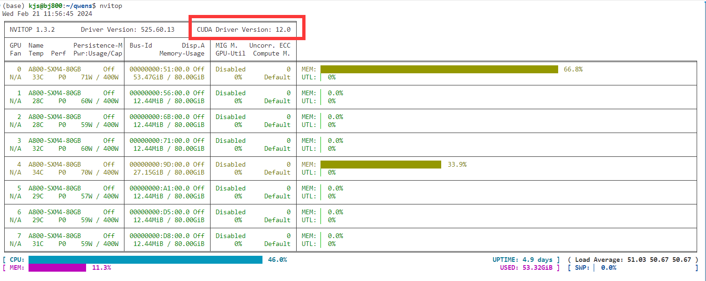
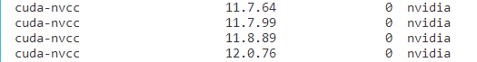

# Transformer加速模块Flash Attention的安装

Flash Attention是LLM训练和推理过程常用的加速模块，还能够降低显存占用. 但是，Flash Attention的安装过程却十分麻烦，下面是我的安装过程。

#### 第一步：创建虚拟环境并激活

```shell
$ conda create -n qwen python=3.10 && conda activate qwen   #这一步没什么可说的
```

#### 第二步：安装CUDA Toolkit

首先，用nvidia-smi或nvitop（这个可以自己pip安装）查看Nvidia驱动支持的最高CUDA版本。这里以12.0为例。



CUDA Toolkit的版本不能超过12.0，我选择11.8版本。命令为

```sh
$ conda install cudatoolkit==11.8 -c nvidia
```

#### 第三步：安装torch

去[PyTorch官网](https://pytorch.org/)寻找合适的安装命令，编译torch的cuda版本需要与CUDA Toolkit版本对应，所以得是11.8。推荐使用conda而不是pip来安装，命令为

```shell
$ conda install pytorch torchvision torchaudio pytorch-cuda=11.8 -c pytorch -c nvidia
```

#### 第四步：安装cuda-nvcc

在前面三个步骤结束之后，用命令`nvcc -V`并不能输出版本信息，还需要安装cuda-nvcc，其版本必须以11.8开头. 先搜索全部版本：

```sh
$ conda search cuda-nvcc -c nvidia
```



合适的版本为11.8.89. 用下面的命令安装即可

```sh
$ conda install cuda-nvcc==11.8.89 -c nvidia
```

#### 第五步：设置环境变量CUDA_HOME

打开`~/.bashrc`，添加语句`export CUDA_HOME=/usr/local/cuda-11.8`，然后`source ~/.bashrc`.

#### 第六步：安装Flash Attention

```sh
$ git clone https://github.com/Dao-AILab/flash-attention
$ cd flash-attention && pip install .
# 下方安装可选，安装可能比较缓慢。
#$ pip install csrc/layer_norm
# 如果flash-attn版本高于2.1.1，下方无需安装。
#$ pip install csrc/rotary
```